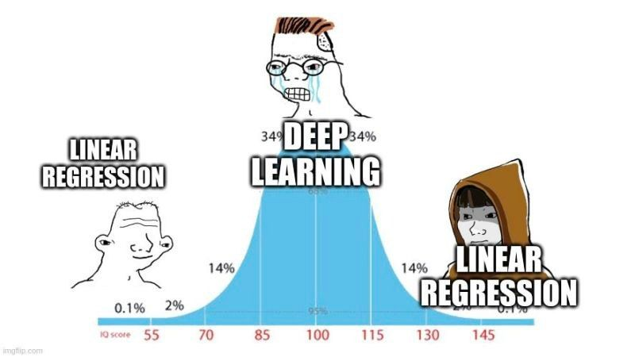
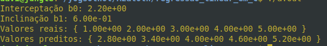

# Regressão Linear em C  

  

Regressão Linear simples tem o formato $y' = b0 + b1 . x'$  
$b0 =$ Inclinação (slope) e $b1 =$ interceptação  
O ajuste é feito com mínimos quadrados ou RSS  

$$
RSS = \sum_{i=1}^{n} (y\_i - y'_i)^2
$$

yi é o i-ésimo valor real de y, e y'i é o i-ésimo valor predito

$$
b1 = \frac{\sum (x - \bar{x})(y - \bar{y})}{\sum (x - \bar{x})^2}
$$

$$
b0 = \bar{y} - b1 \bar{x}
$$

$\bar{y}$ e $\bar{x}$ são as médias

  
> Exemplo de execução.  

Ja implementei regressão Linear em Python no repositório Codigos ISL.  
Essa é uma versão feita em C.  

